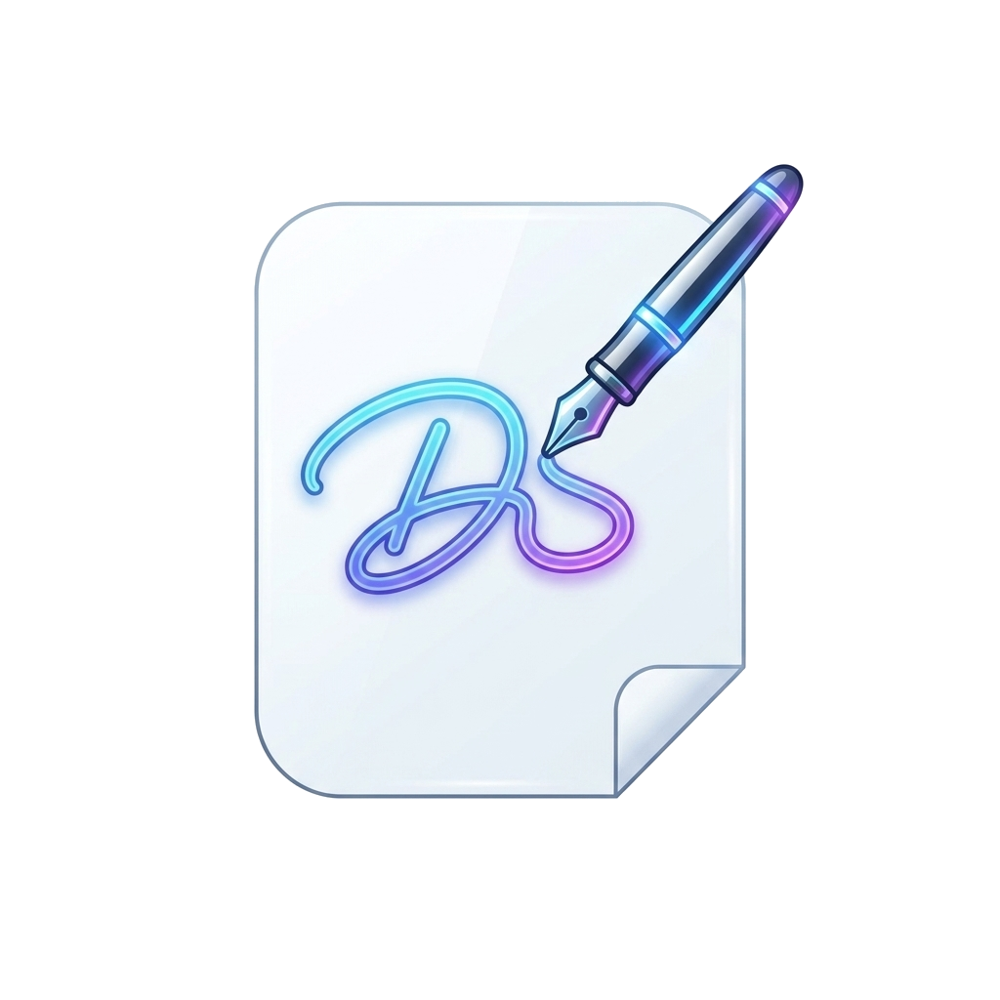

<p align="center">
  
</p>

<h1 align="center">DocuTouchPDF PRO v1.0</h1>

<p align="center">
  <strong>Suite professionale desktop per firmare e annotare documenti PDF su PC utilizzando il proprio smartphone o tablet come touchscreen in tempo reale a 60 fps.</strong>
</p>

<p align="center">
  
  
  
  
  
</p>

---

## 🌟 Perché DocuTouchPDF?

Firmare contratti o moduli PDF sul computer usando il mouse è spesso frustrante e produce firme poco professionali o irriconoscibili. Le tavolette grafiche dedicate sono costose e ingombranti.

**DocuTouchPDF** risolve questo problema trasformando il tuo smartphone o tablet (iOS / Android) in una **tavoletta grafica di firma ad altissima precisione**:
1. **Nessuna app da installare sul telefono**: si apre direttamente dal browser inquadrando il QR Code.
2. **Zero Cloud, 100% Riservato**: tutti i dati restano all'interno della memoria del tuo computer e della tua rete Wi-Fi locale (piena conformità GDPR e segreto professionale).
3. **Puntamento Millimetrico**: fai clic esattamente sopra la riga di firma desiderata e la firma si posiziona al pixel senza algoritmi approssimativi.

---

## 🚀 Funzionalità Principali

### 📊 Dashboard Esecutiva All'Avvio
- **4 Indicatori KPI in tempo reale**: Totale progetti archiviati, documenti firmati, bozze in lavorazione e contatore firme/date apposte.
- **Creation Hub Rapido**: Riquadro interattivo drag-and-drop con feedback visivo per aprire qualsiasi PDF, oppure un clic su *"Prova Contratto Demo"*.
- **Centro di Accoppiamento Smartphone**: QR Code live e link rapido sempre pronti per connettere il telefono.
- **Archivio Progetti Locale**: Ricerca istantanea per nome e filtri a pillola (*Tutti*, *✅ Firmati*, *⏳ Bozze*), con miniature grafiche delle pagine, riapertura nell'Editor ed eliminazione sicura.

### ✍️ Click-to-Sign con Streaming Live a 60 fps
- Clicchi sul foglio nel punto di firma ➔ appare il QR Code ➔ inquadri col telefono ➔ firmi con il dito o pennino capacitivo.
- Il tratto della penna viene trasmesso in diretta a 60 fps con interpolazione di curve di Bézier per un inchiostro naturale, nitido e senza scalettature.

### 📱 Flusso Post-Firma & Chiusura Sessione Intelligente
- Al termine della firma, lo smartphone non rimane bloccato in attesa: presenta due scelte chiare:
  - **✅ "Conferma e Chiudi Sessione"**: Conclude ordinatamente la sessione, disconnette il telefono e notifica il PC con un messaggio di successo.
  - **✍️ "Fai un'altra firma"**: Pulisce il pad ed è subito pronto per la firma successiva.
- Se l'utente sul PC seleziona un nuovo punto di firma, lo smartphone si sblocca automaticamente tornando all'area di disegno!

### 📅 Click-to-Date: Data Odierna Automatica, Spostabile & Scrivibile
- Fai clic sul foglio per inserire all'istante la data corrente.
- Trascinala liberamente con il mouse o con la maniglia dedicata.
- Allineamento millimetrico con i tasti freccia della tastiera (`↑ ↓ ← →` per 1px, `Shift + Frecce` per 5px).
- Fai clic sul testo per digitare qualsiasi annotazione o luogo (es. *"Milano, 08/09/2026"*).

### 🚪 Drawer Laterale Collassabile (Espansione Immersiva a Tutto Schermo)
- Apri e chiudi la barra laterale delle miniature con la scorciatoia da tastiera **`Ctrl + B`** o con il pulsante dedicato.
- Quando il Drawer è chiuso, il documento si espande al **100% della larghezza dello schermo** per la massima leggibilità.
- Discreta linguetta fluttuante laterale per riaprirlo con un clic.
- Su tablet e dispositivi compatti, il Drawer scorre con elegante overlay e sfondo sfocato (`backdrop-filter`).

### 🔽 Menù a Tendina Accessibili (Dropdowns)
- **📁 Documento**: *Nuovo Progetto PDF*, *Prova Demo*, *Salva (Ctrl+S)*, *Stampa (Ctrl+P)*, *Scarica PDF Firmato*.
- **🛠️ Strumenti**: Selezione rapida tra *✍️ Firma Touch* e *📅 Inserisci Data* (con spunta attiva) e comandi di zoom.
- **📱 Dispositivo**: Visualizzazione rapida di stato, miniatura QR e copia link senza abbandonare l'area di lavoro.

### ✍️ Touchpad PC Standalone
- Schermata autonoma per firmare direttamente dal computer con mouse, trackpad o display touch PC, con selezione colore inchiostro (*Nero*, *Blu Firma*, *Rosso*), cancellazione veloce ed esportazione in PNG trasparente ad alta risoluzione.

---

## 📦 Installazione & Avvio

### Metodo 1: Installer Nativo Windows (Consigliato)
È disponibile il pacchetto di installazione nativo per Windows compilato con **Inno Setup**:
1. Esegui il file di installazione:
   ```
   installer_output/DocuTouchPDF_Setup_v1.0.0.exe
   ```
2. Segui la procedura guidata (in italiano o inglese).
3. L'installer configurerà:
   - Icona sul Desktop: **DocuTouchPDF PRO**
   - Icona nel Menu Start: **DocuTouchPDF PRO**
   - Collegamento rapido alla cartella locale dei progetti salvati
   - Collegamento rapido per arrestare l'applicazione
   - Apertura fluida in modalità finestra nativa (Microsoft Edge / Chrome App Mode, senza barre di navigazione o schede)
   - Architettura 100% pulita e sicura, compatibile con tutti gli antivirus (Windows Defender, McAfee, Norton, Bitdefender, ecc.) senza falsi positivi.

### Metodo 2: Esecuzione Portatile da Sorgente
Requisiti: [Node.js](https://nodejs.org/) (versione 18 o superiore).

```bash
# 1. Clona il repository
git clone https://github.com/raffaeleditullo-cloud/DocuTouchPDF.git
cd DocuTouchPDF

# 2. Installa le dipendenze
npm install

# 3. Avvia l'applicazione
npm start
```
Oppure fai doppio clic su [`start.bat`](file:///c:/Users/stree/Desktop/Firma%20PDF/start.bat) o [`DocuTouchPDF.vbs`](file:///c:/Users/stree/Desktop/Firma%20PDF/DocuTouchPDF.vbs).  
L'applicazione si aprirà automaticamente come App Desktop su **`http://localhost:3000`**.

Per arrestare il server in background, fai doppio clic su [`stop.bat`](file:///c:/Users/stree/Desktop/Firma%20PDF/stop.bat) oppure seleziona *"Esci dall'Applicazione"* dal menù Documento.

---

## 🛠️ Come Compilare l'Installer con Inno Setup

Se desideri rigenerare l'installer Windows:
```cmd
ISCC.exe DocuTouchPDF_Setup.iss
```
Il file di installazione completato verrà salvato in `installer_output/DocuTouchPDF_Setup_v1.0.0.exe`.

---

## ⌨️ Scorciatoie da Tastiera

| Scorciatoia | Funzione |
| :--- | :--- |
| **`Ctrl + B`** | **Apri / Chiudi Drawer Laterale (Espandi PDF a tutto schermo)** |
| **`Ctrl + S`** | Salva il progetto corrente nell'archivio locale permanente |
| **`Ctrl + P`** | Stampa direttamente il documento compilato |
| **`↑ ↓ ← →`** | Micro-spostamento millimetrico della casella data (1px) |
| **`Shift + Frecce`** | Spostamento rapido della casella data (5px) |
| **`Esc`** | Chiudi finestre modali, popover QR e menù a tendina |

---

## 📁 Struttura del Repository

```
DocuTouchPDF/
├── DocuTouchPDF.vbs          # Launcher nativo Windows (Silenzioso, App Mode, 0 Falsi Positivi)
├── DocuTouchPDF_Setup.iss    # Script di compilazione installer Inno Setup
├── server.js                 # Server Node.js (Express, WebSocket streaming, API progetti, /shutdown)
├── package.json              # Configurazione e dipendenze del progetto
├── README.md                 # Manuale d'uso completo e documentazione
├── start.bat                 # Script di avvio rapido con doppio clic
├── stop.bat                  # Script di arresto pulito del server locale
├── scripts/
│   ├── Launcher.cs           # Sorgente C# del launcher standalone
│   └── make_icon.ps1         # Script per generazione icone .ico multi-risoluzione
├── saved_projects/           # Archivio locale protetto su disco per i documenti PDF
└── public/                   # Interfaccia grafica completa della suite
    ├── index.html            # Dashboard esecutiva, Editor e viste integrate
    ├── touchpad.html         # Interfaccia touchscreen ottimizzata per smartphone
    ├── favicon.png           # Favicon dell'applicazione
    ├── assets/
    │   ├── logo.png          # Logo ufficiale DocuTouchPDF ad alta risoluzione
    │   └── app.ico           # Icona nativa per l'installer e il software Windows
    ├── css/
    │   ├── desktop.css       # Design system dark glassmorphism & responsive media queries
    │   └── touchpad.css      # Stili touch mobile ad alta sensibilità
    ├── js/
    │   ├── desktop.js        # Controller suite, router viste, renderer PDF e WebSocket
    │   └── touchpad.js       # Motore Bézier smoothing, streaming live e gestione sessione
    └── vendor/
        ├── pdf.min.js        # Motore di rendering PDF locale
        ├── pdf.worker.min.js # Worker thread PDF.js
        └── pdf-lib.min.js    # Compilazione ed esportazione vettoriale ad alta fedeltà
```

---

## 🔒 Riservatezza & Conformità GDPR (100% Offline)

- **Nessuna dipendenza da server esterni**: L'intera applicazione viene eseguita in locale sul tuo computer.
- **Nessun salvataggio su cloud**: Le firme tracciate e i file PDF risiedono unicamente nella cartella `saved_projects/` sul disco locale del PC.
- **Massima sicurezza**: Adatto per studi legali, commercialisti, uffici HR, medici e aziende che gestiscono contratti e dati confidenziali.

---

## 📄 Licenza

Distribuito sotto licenza **MIT**. Consulta il file `LICENSE` per ulteriori dettagli.

Sviluppato con passione per semplificare la firma digitale di ogni giorno.
